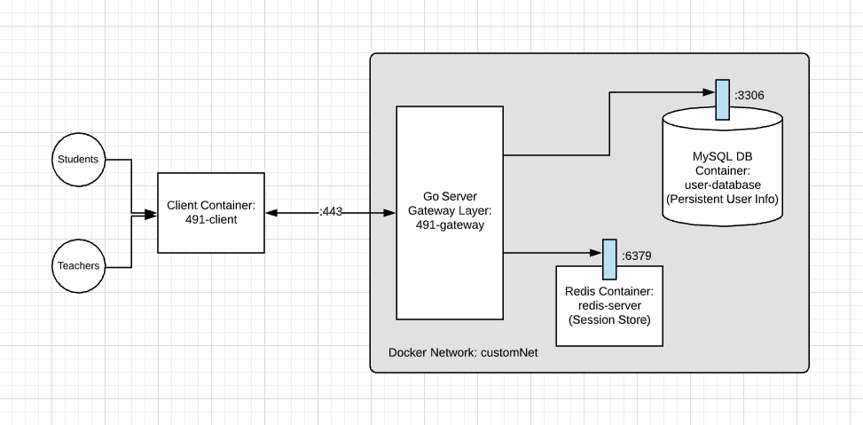

# Habihero

*Habihero is a web-based application dedicated to helping 1st graders overcome their numeracy difficulties with embedded conservational and environmental values.*
  
Habihero utilizes game-based learning through a focus on saving endangered animals.
Each endangered species (4 in total) represents a topic in the math curricula (adhereing to the Common Core Standard);
users must solve a variety of math problems pertaining to that topic in order to clean up the animal's environment.  

You can play our game at [habihero.com](https://habihero.com).  

## Installation
  
If you want to build and run the project with mock data, please follow the instructions below.  

1. First, clone the repository:  

    ```bash
    git clone https://github.com/jyu98-1661808/capstone2020.git
    ```

2. Set Up Local Server:

    **Navigate to capstone2020/habihero/server and run the following commands:**  

    * Create docker private network on local machine  

    ```bash
    docker network create demoNet
    ```

    * Create local redis server (session store) within private network

    ```bash
    docker run -d --name redisServer --network demoNet redis
    ```

    **Navigate to capstone2020/habihero/server/db and run the following commands:**  

    * Create MySQL database (persistent data store) within private network  

    ```bash
    docker run -d --name user-database --network=customNet mysql
    ```

    **Navigate to capstone/habihero/server/gateway and run the following commands:**  

    * Run Go Server

    ```bash
    docker run --network customNet -d --name 491-gateway -p 80:80 alpine
    ```

3. Run App:

    **Navigate to capstone2020/habihero/client and run the following commands:**  

    * Install dependencies

    ```bash
    npm install
    ```

    * Run app in the development mode

    ```bash
    npm run
    ```

    Open [http://localhost:3000](http://localhost:3000) to view it in the browser.  

## Technical Description



### API Design

#### Endpoints

* **‘/signup**
  * `POST`: Create a new user account
    * `201`: `application/json`. Successfully create a new account
    * `500`: Internal server error
* **‘/signin**
  * `POST`: Sign in to existing user account
    * `200`: Successfully signed in
    * `500`: Internal server error
* **‘/signout**
  * `POST`: Sign out currently signed in user
    * `200`: Successfully signed out
    * `500`: Internal server error

#### Models

For our persistent data store we use a **MySQL** DB.

#### Users

‘user’: users will be represented in the database.

```go
{
    “UserId”: “id_value”,
    “Email”: “email_value”,
    “UserName”: “username_value”,
    “FirstName”: “firstname_value”,
    “LastName”: “lastname_value”,
}
```

## Contributing

Pull requests are welcome.  
The best way to submit feedback and report bugs is to open a Github issue.  
Please be sure to include your operating system, device, version number, and steps to reproduce reported bugs.  

## License

[MIT](https://choosealicense.com/licenses/mit/)

## Contact

:tiger: Jiyun Yu, *front-end developer*: jyu98@uw.edu </br>
:rabbit: Chad Ohta, *back-end developer*: chadohta@gmail.com </br>
:dog: Andre Magallanes, *UX/UI designer*: magalj@uw.edu </br>
:panda_face: Adam Pumputis, *graphic designer*: akyp@uw.edu </br>
